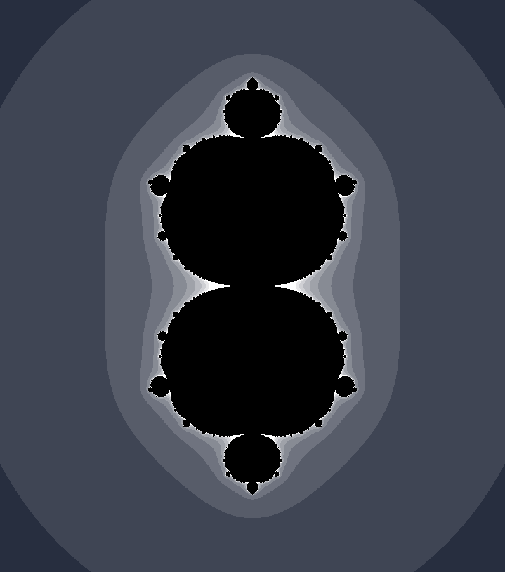

# Fractals!
A simple project for making fractals  
</img>   
A fractal ^

## What is this?
You can generate z = z^2 + c fractals (Thats supposed to be the mandelbrot set but I messed up somewhere), you can also change the 2 to any other number and get differrent fractals, it will have k-1 'arms' where k is the exponent.  
You can manually traverse the fractal by clicking it, or generate a video like [this](./1000Frames.mp4) one or [this](./exponent.mp4) one by manipulating the exponent

## How to use

Step 1: Clone the repo
```
git clone https://github.com/AdrianRang/FRACTALS
```

### Fractal explorer

Run `Main.java` note `ComplexDouble.java` must be compiled (use `javac`)  
Or run it through your IDE

### Zoom Video

There are 2 ways to do these, and both require [ffmpeg](https://www.ffmpeg.org/ffmpeg.html)

#### Way #1

Run `sh generate.sh` on your terminal 
> [!NOTE]
> You need to make a change to that file first

#### Way #2

Run `Video.java` (Make sure the frames directory is empty)
Run:
```
ffmpeg -r 30 -i frames/frame_%d.png -vcodec libx264 output.mp4
```

### Exponent Video

There are 2 ways to do these, and both require [ffmpeg](https://www.ffmpeg.org/ffmpeg.html)

#### Way #1

Run `sh exponent.sh` on your terminal 
> [!NOTE]
> You need to make a change to that file first

#### Way #2

Run `VideoExp.java` (Make sure the frames directory is empty)
Run:
```
ffmpeg -r 30 -i frames/frame_%d.png -vcodec libx264 output.mp4
```

## Customizing the fractals

If you want to change the color, video duration, zoom, etc. go into the file you'll run, and there you will find all necessary variables at the top of the document

## Why I did this
I always have found fractals fascinating, how such complicated shapes can arise from simple formulas. This is a project I have always wanted to do, but never got the inspiration for. Until I was watching a video on the subject and it got explained really well... So I said 'I can do this' and supprisingly I did! i do find hipnotizing how you can essentially zoom in forever (or at least until i dont reach the precission limit of the double) and still see the same thing.

## Why Java?
Because I wanted to.

</img>   
Happy last day of High Seas!